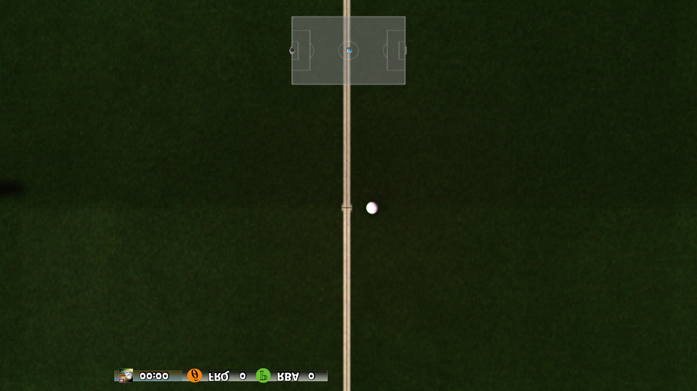
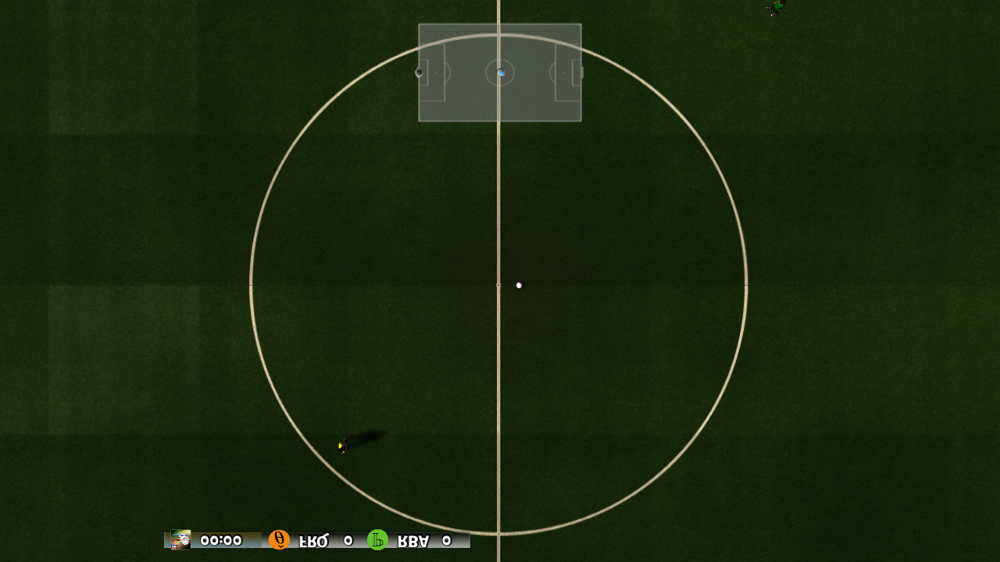
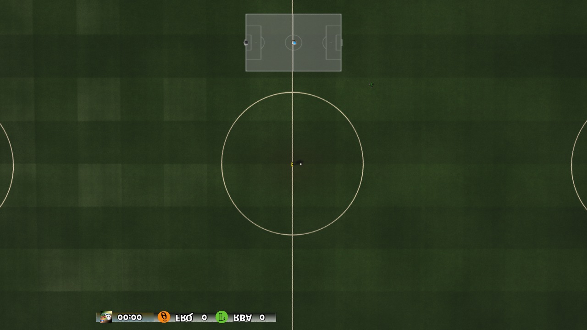

# 展示平滑与回滚验收

归属 `ms-22.1 → plan-22.1.2 → task-22.1.2.1`。本轮把 [`presentation_smoothing.py`](../gates/presentation_smoothing.py) 接入 [`program.json`](../optimization/program.json) 的正式质量编排。`python3 .project/quality.py run task-22.1.2.1` 通过，任务为 `verified`；质量自测、性能回归、固定步长前置检查也通过。

门禁使用当前源码构建的原生 `GameEnv` 和实际 1280×720 像素，先显示预测路径的插值姿态，再从同一起点回滚到不同输入路径。回滚第一帧与此前屏幕一致，中间帧产生可见变化；在中间帧再次改目标时，下一帧继续从当前屏幕姿态出发，最终到达新目标。暂停期间连续 12 次渲染保持同一像素和物理摘要，渲染过程没有修改物理状态，退出后没有遗留原生引擎实例。原生姿态合同另检查 6 张中间帧／卡片图像和 8 种卡片情况。

正式报告记录 543 项断言、零跳过：29 项实际回滚与暂停检查、439 项姿态合同、72 项当前框架的 Python 展示／暂停回归，以及单机、TCP、UDP 三个实际产品窗口。产品窗口分别完成 76、80、81 次渲染，每次都有对应画面交换；网络窗口的松键、失焦、暂停、恢复屏障和重新按键检查继续通过。报告记录了源码、原生二进制、命令日志、帧图像与产品窗口证据的哈希。

提交的完整报告为 [`presentation_smoothing_current_20261001_report.json.gz`](../optimization/evidence/presentation_smoothing_current_20261001_report.json.gz)，SHA-256 `91b23d764b4b60931772eb425dee65237e29070b76b1d5cad8aa36e520be6ddb`；解压后的报告 SHA-256 为 `d24bf5174fece98e1670647aa881bd7a5918730e5275a067c6cda00c7d0f5ebe`。正式门禁记录见 [`presentation_smoothing.json`](../optimization/evidence/presentation_smoothing.json)，可用 `python3 .project/quality.py run task-22.1.2.1` 重跑。

可直接复核三张实际帧图：预测可见姿态 、修正中间帧 、二次改目标后的终点 。完整报告中的 `correction_start` 与回滚前帧哈希相同，`retarget_start` 与中间帧哈希相同，`paused_endpoint` 与终点哈希相同。

本门禁证明展示连续性、暂停端点稳定和既有产品窗口的输入清除行为；它没有测量多次设备输入到实际球员像素响应的 p95。下一项 `task-22.1.2.2`（手感自动验收）仍为 `planned`，所以 `ms-22.1` 保持 `planned`，不把该单项通过表述为里程碑完成。
